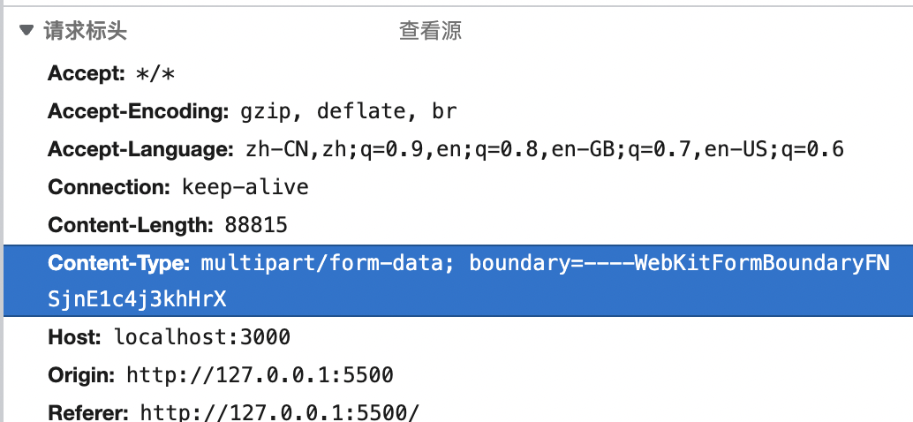
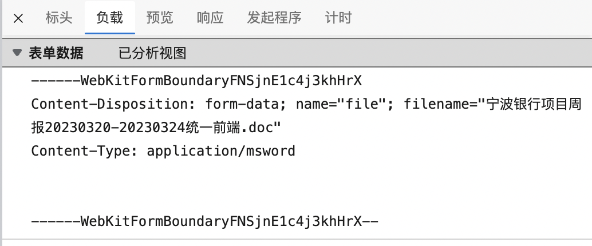

# 上传

## `原理概念`
将用户选择的文件通过浏览器发送到服务器。在Web应用中，浏览器通过HTTP请求与服务器进行通信。文件上传的过程实际上就是将文件作为HTTP请求的一部分发送到服务器。  

我们都知道如果要上传一个文件，需要把 form 标签的enctype设置为multipart/form-data,同时method必须为post方法。
#### 那么multipart/form-data表示什么呢？
> `multipart/form-data`是一种MIME类型，用于表示HTTP请求中包含多个部分的数据，这些部分可以是文本数据或文件数据。它主要用于文件上传场景，可以在一个请求中同时发送表单字段和文件数据。multipart/form-data编码类型将HTTP请求分为多个部分，每个部分都有自己的头信息和数据。部分之间通过一个分隔符分开，分隔符在请求的Content-Type头中指定。



- 请求头  
`Content-Type: multipart/form-data; boundary=----WebKitFormBoundaryFNSjnE1c4j3khHrX`表示本地请求要上传的文件  

- 消息体- Form Data 部分  
每一个表单项又由`Content-Disposition`和`Content-Type`组成。  
`Content-Disposition: form-data` 为固定值，表示一个表单元素，name/filename指示字段名称和文件名（如果是文件字段）  
`Content-Type`：表示当前的内容的 MIME 类型，是图片还是文本还是二进制数据。

## `fetch + FormData上传文件`
```javascript
// input定义multiple设置为多文件上传
<input type="file" id="file-input" multiple />
<button id="upload-button">上传文件</button>
// 为ID为'upload-button'的按钮元素添加'click'事件监听器
document.getElementById('upload-button').addEventListener('click', () => {
  // 获取ID为'file-input'的文件输入元素
  const fileInput = document.getElementById('file-input');
  // 获取文件输入元素中的文件列表
  const files = fileInput.files;

  // 检查是否选择了文件
  if (!files.length) {
    alert('请选择一个文件');
    return;
  }

  // 创建一个FormData实例
  const formData = new FormData();
  // 遍历文件列表并将文件添加到FormData实例中
  for (const file of files) {
    formData.append('files', file);
  }
  
  const uploadUrl = 'http://localhost:3000/upload-multiple';

  // 使用fetch API发送POST请求到指定的URL
  fetch(uploadUrl, {
    method: 'POST',
    body: formData, // 将formData作为请求体
  })
    // 当请求成功时，解析响应为文本
    .then((response) => {
      if (!response.ok) {
        throw new Error('网络错误，无法上传文件');
      }
      return response.text();
    })
    // 将解析后的文本数据打印到控制台，并显示上传成功的提示
    .then((data) => {
      console.log('文件上传成功:', data);
      alert('文件上传成功');
    })
    // 如果发生错误，打印错误信息到控制台，并显示上传失败的提示
    .catch((error) => {
      console.error('文件上传失败:', error);
      alert('文件上传失败');
    });
});
```

## `大文件上传 -> 切片`
在JavaScript中，文件FIle对象是Blob对象的子类，Blob对象包含一个重要的方法slice通过这个方法，我们就可以对二进制文件进行拆分,具体代码如下:
```javascript
var file = null;

// 为ID为'file-input2'的文件输入元素添加'change'事件监听器
document.getElementById('file-input2').onchange = function ({ target: { files } }) {
  // 当文件选择发生变化时，将选中的文件赋值给file变量
  file = files[0];
};

// 为ID为'upload-button2'的按钮元素添加'click'事件监听器
document.getElementById('upload-button2').onclick = async function () {
  // 如果没有选择文件，则直接返回
  if (!file) return;

  // 创建文件切片
  // let size = 1024 * 1024 * 10; // 10MB 切片大小
  let size = 1024 * 50; // 50KB 切片大小
  let fileChunks = [];
  let index = 0; // 切片序号

  // 将文件分割为大小为'size'的切片，并将它们添加到fileChunks数组中
  for (let cur = 0; cur < file.size; cur += size) {
    fileChunks.push({
      hash: index++,
      chunk: file.slice(cur, cur + size),
    });
  }

  // 为每个切片创建一个上传任务
  const uploadList = fileChunks.map((item, index) => {
    let formData = new FormData();
    formData.append('filename', file.name);
    formData.append('hash', item.hash);
    formData.append('chunk', item.chunk);

    // 发送POST请求将切片上传到服务器
    return fetch('http://localhost:3000/upload', {
      method: 'POST',
      body: formData,
    });
  });

  // 使用Promise.all等待所有切片上传完成
  await Promise.all(uploadList);

  // 请求服务器合并切片
  await fetch('http://localhost:3000/merge?filename=' + file.name, {
    method: 'GET',
  });

  console.log('上传完成');
};
```

## `大文件上传 -> 切片 + 并发控制`
```javascript
var file = null;

// 为ID为'file-input3'的文件输入元素添加'change'事件监听器
document.getElementById('file-input3').onchange = function ({ target: { files } }) {
  // 当文件选择发生变化时，将选中的文件赋值给file变量
  file = files[0];
};

// 为ID为'upload-button3'的按钮元素添加'click'事件监听器
document.getElementById('upload-button3').onclick = async function () {
  // 如果没有选择文件，则直接返回
  if (!file) return;

  // 创建文件切片
  let size = 1024 * 50; // 50KB 切片大小
  let fileChunks = [];
  let index = 0; // 切片序号

  // 将文件分割为大小为'size'的切片，并将它们添加到fileChunks数组中
  for (let cur = 0; cur < file.size; cur += size) {
    fileChunks.push({
      hash: index++,
      chunk: file.slice(cur, cur + size),
    });
  }

  // 控制并发
  let pool = []; // 并发池
  let max = 3; // 最大并发量

  for (let i = 0; i < fileChunks.length; i++) {
    let item = fileChunks[i];
    let formData = new FormData();
    formData.append('filename', file.name);
    formData.append('hash', item.hash);
    formData.append('chunk', item.chunk);

    // 上传切片
    let task = fetch('http://localhost:3000/upload', {
      method: 'POST',
      body: formData,
    });

    task.then((data) => {
      // 请求结束后将该Promise任务从并发池中移除
      let index = pool.findIndex((t) => t === task);
      pool.splice(index, 1);
    });

    pool.push(task);

    // 当并发池中的任务数量达到最大并发量时
    if (pool.length === max) {
      // 使用Promise.race等待并发池中任何一个任务完成
      await Promise.race(pool);
    }
  }

  // 请求服务器合并切片
  await fetch('http://localhost:3000/merge?filename=' + file.name, {
    method: 'GET',
  });

  alert('上传完成');
};
```
Promise.race()是一个静态方法，它接受一个Promise对象数组作为参数。当数组中的任意一个Promise对象的状态发生变化（变为已解决或已拒绝）时，Promise.race()会立即返回。这就是说，Promise.race()将等待数组中最先完成的Promise对象，并返回其结果。其他未完成的Promise对象将继续执行，但不会影响Promise.race()的结果。

在这个示例中，Promise.race(pool)用于等待并发池中任何一个任务完成。当有任务完成时，await Promise.race(pool)会解除阻塞，允许下一个任务进入并发池，这样就实现了并发控制。

当并发池中的任务数量达到最大并发量时，代码会等待任何一个任务完成，然后继续添加新任务。这样，我们可以保证并发池中的任务数量不会超过最大并发量，从而实现了对上传切片的并发控制。

这种方法可以有效地控制并发上传的数量，避免过多的并发请求导致服务器压力过大。同时，它还可以保证上传任务的执行顺序，确保所有切片都能被正确上传和处理。

## `大文件上传 -> 切片 + 并发控制 + 单文件上传失败处理`
```javascript
var file = null;

// 为ID为'file-input3'的文件输入元素添加'change'事件监听器
document.getElementById('file-input4').onchange = function ({ target: { files } }) {
  // 当文件选择发生变化时，将选中的文件赋值给file变量
  file = files[0];
};

// 为ID为'upload-button3'的按钮元素添加'click'事件监听器
document.getElementById('upload-button4').onclick = async function () {
  if (!file) return;
  // 创建切片   
  // let size = 1024 * 1024 * 10; //10MB 切片大小
  let size = 1024 * 50; //50KB 切片大小
  let fileChunks = [];
  let index = 0 //切片序号
  for(let cur = 0; cur < file.size; cur += size){
    fileChunks.push({
        hash: index++,
        chunk: file.slice(cur, cur + size)
    })
  }
  // 控制并发和断点续传
  const uploadFileChunks = async function(list){
      if(list.length === 0){
          //所有任务完成,合并切片
          await fetch('http://localhost:3000/merge?filename=' + file.name, {
            method: 'GET'
          }).then(res => {
            return res.text();
          }).then(text => {
            alert(text);
          })
          return
      }
      let pool = []//并发池
      let max = 3 //最大并发量
      let finish = 0//完成的数量
      let failList = []//失败的列表
      for(let i=0;i<list.length;i++){
          let item = list[i]
          let formData = new FormData()
          formData.append('filename', file.name)
          formData.append('hash', item.hash)
          formData.append('chunk', item.chunk)
          // 上传切片
          let task = fetch('http://localhost:3000/upload', {
            method: 'POST',
            body: formData
          })
          task.then((data)=>{
              //请求结束后将该Promise任务从并发池中移除
              let index = pool.findIndex(t=> t===task)
              pool.splice(index)
          }).catch(()=>{
              failList.push(item)
          }).finally(()=>{
              finish++
              //所有请求都请求完成
              if(finish===list.length){
                  uploadFileChunks(failList)
              }
          })
          pool.push(task)
          if(pool.length === max){
              //每当并发池跑完一个任务，就再塞入一个任务
              await Promise.race(pool)
          }
      }
  }
  uploadFileChunks(fileChunks)
};
```
在先前代码的基础上，我们增加了一个失败列表。在catch回调后将上传失败的切片填充进去，然后通过finally回调内判断所有切片是否请求完成，在所有接口都请求完成以后进行自调用，传入的切片列表，再次进行上传。